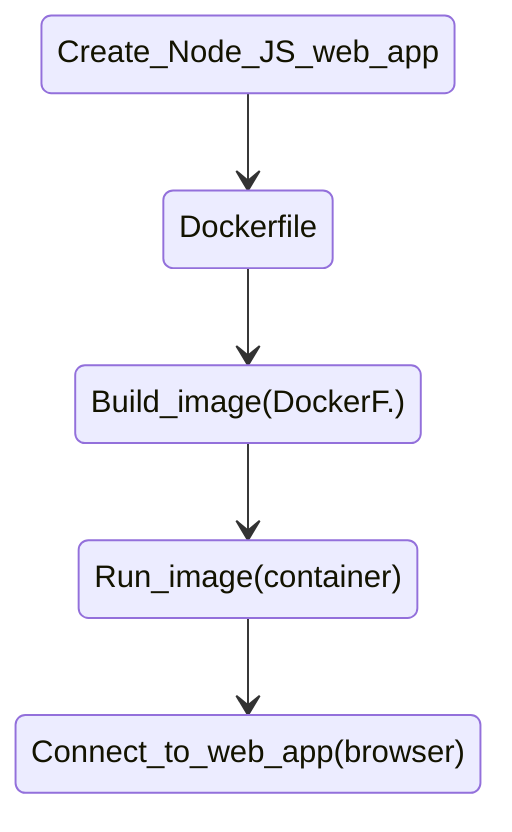

# Node js & redis App visits
* Esta aplicación que muestra el número de visitas usando nodejs y redis.
```                                          
   Página web
    +---------------------------+
    |  https://localhost:8080   |      
    |                           |     |----------|     |-------------|
    |   Number of visits : 10   | --> | node app | --> |    redis    |
    |                           |     |----------|     | visits = 10 |
    +---------------------------+                       -------------
```  

* Diagram de construcción de la app, con los contenedores.

```                                          
 docker container                         
   +--------+                             
   |node app|--------\                    
   +--------+         \                   
 docker container      \  docker container
   +--------+           \   +------+      
   |node app|--------->  -> |redis |      
   +--------+           /   +------+      
 docker container      /                  
   +--------+         /                   
   |node app|--------/                    
   +--------+                             
```                                  

* Pasos para correr la app
    * Compilar la imagen es con docker-compose ya que usa varios contenedores.
    * `docker-compose.yml.` -> archivo con las instrucciones para compilar imagen y ejecutar los contenedores. Se usa el docker-compose para no tener que correr en la terminal cada uno por separado.
    * Para correr es `docker-compose up` y para compilar, `docker-compose down` para acabar con los contenedores y removerlos. 
    * `docker-compose up --build` es para compilar la imagen si cambia el código.
    * El`Dockerfile` es sólo para el código de nodejs.
    * Abrir el navegador en `localhost:8081` -> poner el puerto donde se mapeo el puerto del contenedor.
    * Observar la página de nodejs corriendo.




            