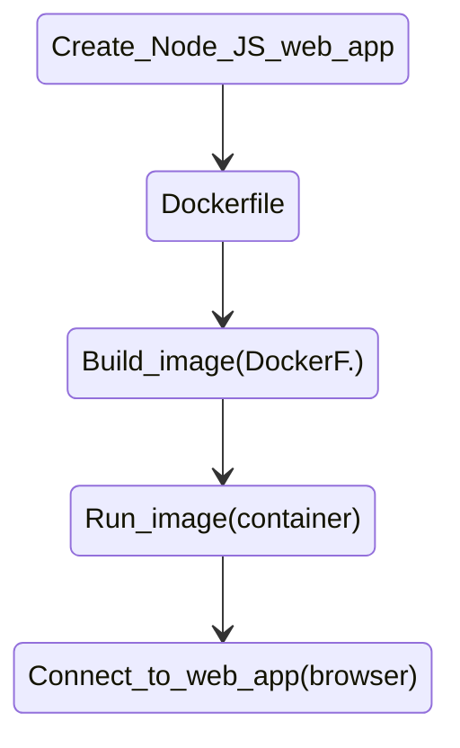

## Flow Diagram Node js app

```mermaid
stateDiagram-v2
    Create_Node_JS_web_app --> Dockerfile
    Dockerfile --> Build_image(DockerF.)
    Build_image(DockerF.) --> Run_image(container)
    Run_image(container) --> Connect_to_web_app(browser)
```

            