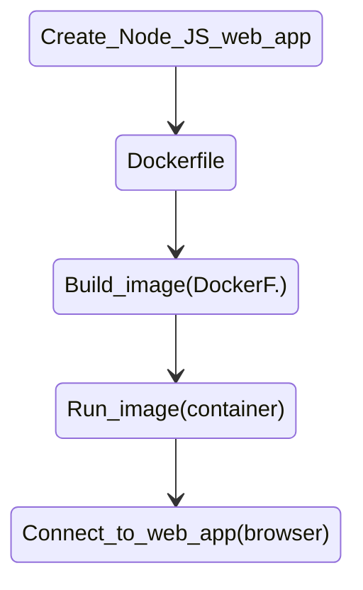

# Flow Diagram Node js app
* Pasos para correr la app
    * Compilar la imagen del `Dockerfile`.
    * `docker build -tag <docker_hub_id>/<nombre>:<versión> .`. 
    * Correr la imagen con : `docker build -p 8080:8080 <image id/nombre>`.
    * Abrir el navegador en `localhost:8080` -> poner el puerto donde se mapeo el puerto del contenedor.
    * Observar la página de nodejs corriendo.

            